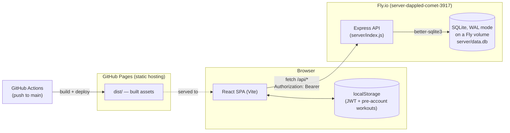
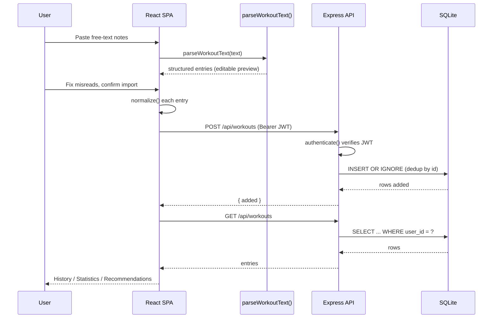

# Personal Fitness Tracker

A workout log built around one idea: keep writing workouts in your notes app the
way you already do, then paste them in. The app parses free text into structured
entries, you fix anything it misread in an editable preview, and it's saved to
your account — accessible from any device.

## Features

- **Paste-to-structured import** — free-text notes in, structured sets/reps/weight
  out, with an editable preview before anything is saved.
- **Accounts** — email/password auth; your log follows you across devices instead
  of living in one browser.
- **History & Statistics** — browse past sessions, delete individual entries or
  whole days, and view progress charts (Recharts) by exercise over time.
- **Recommendations** — suggests the next weight to try per exercise based on
  whether you hit your reps at the current top weight last time.
- **CSV import/export** — round-trip your data to a spreadsheet; duplicate
  detection skips entries you've already logged.
- **Pre-account data migration** — workouts logged before you had an account
  (stored in `localStorage`) can be pulled into your account on first sign-in.

## System design

Two independently deployed pieces: a static front end and a small JSON API.



- **Front end**: React 19 + Vite, no server-side rendering. Built to static
  assets and deployed to GitHub Pages on every push to `main`
  ([.github/workflows/deploy.yml](.github/workflows/deploy.yml)).
- **Back end**: Express + `better-sqlite3`, deployed as a Docker container to
  Fly.io ([server/fly.toml](server/fly.toml), [server/Dockerfile](server/Dockerfile)).
  SQLite lives on a persistent Fly volume mounted at `/data`, so it survives
  redeploys.
- **Auth**: stateless — a JWT (7-day expiry) is issued on login/signup, stored in
  the browser's `localStorage`, and sent as a `Bearer` token on every API call.
  The server never holds session state.
- **No shared secrets in the client**: the only thing the front end knows is the
  API's base URL (`VITE_API_URL`, injected at build time from a GitHub Actions
  repo variable). In dev, Vite proxies `/api` to `localhost:3001` instead
  ([vite.config.js](vite.config.js)).

### Request flow: paste → save



### Data model

`users` and `workouts` tables in SQLite ([server/db.js](server/db.js)), one-to-many
on `user_id`:

```
users                          workouts
------------------------       ------------------------------
id INTEGER PK                  id TEXT PK              (UUID)
email TEXT UNIQUE              user_id INTEGER FK -> users.id
password_hash TEXT             date TEXT
unit TEXT ('lb' | 'kg')        session TEXT
created_at TEXT                exercise TEXT
                                sets INTEGER
                                reps INTEGER
                                weight REAL
                                unit TEXT
                                bodyweight INTEGER (0/1)
                                duration_min REAL
                                distance REAL
                                distance_unit TEXT
                                notes TEXT
                                raw TEXT
                                created_at TEXT

INDEX idx_workouts_user_date ON workouts(user_id, date)
```

Every workout row the front end works with is normalized to the same shape
client- and server-side: `{ id, date, session, exercise, sets, reps, weight,
unit, bodyweight, durationMin, distance, distanceUnit, notes, raw }`
(see [src/lib/storage.js](src/lib/storage.js) and
[server/workouts.js](server/workouts.js)).

### API reference

**[Interactive API explorer](https://kemunoz.github.io/personal-fitness-tracker/api-docs/)**
— a [Redoc](https://github.com/Redocly/redoc) page rendering
[`public/openapi.yaml`](public/openapi.yaml), the OpenAPI 3.0 spec for every
route below (request/response schemas, examples). It's a static page built
from `public/api-docs/index.html`, so it ships with the front end and needs no
separate hosting; edit `public/openapi.yaml` whenever a route changes. Run
`npm run dev` and open `/api-docs/` locally to preview it.

All routes are prefixed `/api`. Everything under `/workouts` requires
`Authorization: Bearer <token>`.

| Method | Path | Body | Response |
| --- | --- | --- | --- |
| POST | `/auth/signup` | `{ email, password }` | `201 { token }` |
| POST | `/auth/login` | `{ email, password }` | `200 { token }` |
| GET | `/auth/me` | — | `{ id, email, unit }` |
| PATCH | `/auth/me` | `{ unit: 'lb' \| 'kg' }` | `{ id, email, unit }` |
| GET | `/workouts` | — | `[entry, ...]`, newest date first |
| POST | `/workouts` | `[entry, ...]` | `201 { added }` — dedups by `id` |
| DELETE | `/workouts/:id` | — | `{ ok: true }` |
| DELETE | `/workouts?date=YYYY-MM-DD` | — | `{ deleted }` |
| DELETE | `/workouts?all=true` | — | `{ deleted }` |

### Pre-account data migration

Before accounts existed, workouts lived only in `localStorage`. That code path
is still there deliberately: on load, the app checks for un-migrated local
entries and — once signed in — offers to copy them into the account
([src/components/MigrateBanner.jsx](src/components/MigrateBanner.jsx)). Entries
keep their original UUID, so the server's `INSERT OR IGNORE` makes the migration
safe to retry. The local copy is never deleted automatically, only flagged as
migrated, so a failed import is still recoverable.

## Tech stack

| Layer | Choice |
| --- | --- |
| Front end | React 19, Vite, plain JSX (no TypeScript) |
| Charts | Recharts |
| Styling | Vanilla CSS, custom properties, light/dark via `prefers-color-scheme` |
| Back end | Node.js, Express 5 |
| Database | SQLite via `better-sqlite3`, WAL mode |
| Auth | bcrypt password hashing, JWT (`jsonwebtoken`) |
| Front-end hosting | GitHub Pages, deployed by GitHub Actions |
| API hosting | Fly.io (Docker), persistent volume for the SQLite file |
| Linting | oxlint (not ESLint) |

No test framework is currently configured for either package.

## Running it locally

You need both the API and the front end running; Vite proxies `/api` calls to
the API in dev.

```sh
# terminal 1 — API (http://localhost:3001)
cd server
npm install
npm run dev      # sets a throwaway JWT_SECRET for local use

# terminal 2 — front end (http://localhost:5173/personal-fitness-tracker/)
npm install
npm run dev
```

Other front-end commands:

```sh
npm run build     # production build into dist/
npm run preview   # serve the production build locally
npm run lint       # oxlint
```

The API reads `JWT_SECRET` (required — the server refuses to start without it
in production) and `DB_PATH` (defaults to a file beside `server/db.js`; set to
the Fly volume mount in production).

## Deployment

- **Front end**: pushing to `main` triggers
  [.github/workflows/deploy.yml](.github/workflows/deploy.yml), which builds
  with `VITE_API_URL` set from the `API_URL` repository variable and deploys
  `dist/` to GitHub Pages.
- **API**: deployed separately to Fly.io from `server/` (`fly deploy`), using
  the Dockerfile and `fly.toml` in that directory. `server/db.js` points at the
  Fly volume (`/data/data.db`) via `DB_PATH` in production and falls back to a
  local file otherwise.
- CORS on the API is locked to the GitHub Pages origin and `localhost:5173`
  ([server/index.js](server/index.js)) — there's no wildcard origin.

## How the paste box works

Paste notes, check the preview table, fix anything misread, import. The preview
is editable, so a wrong guess is a two-second correction rather than a re-type.

Recognized shapes:

| In your notes | Read as |
| --- | --- |
| `2026-09-02`, `9/2`, `Sept 2`, `Mon 9/2 — Push day`, `Today` | starts a new day |
| an exercise name alone on a line | applies to the set lines beneath it |
| `135 x 8` | weight × reps |
| `3x5`, `3x5 @ 225`, `3 sets of 12 reps @ 50 lb` | sets × reps @ weight |
| `135x8x3` | weight × reps × sets |
| `BW x 12`, `Dips BW x 12 x 3` | bodyweight sets |
| `225x5, 245x5, 265x3` | three separate sets |
| `3mi 24:30`, `30 min`, `5000m`, `Plank 3 x 45s` | distance and duration |
| `(felt heavy)` | a note on that set |

Two deliberate guesses, both visible in the preview:

- A leading number **over 12** is treated as weight, **12 or under** as a set count —
  so `135 x 8` is 135 lb for 8 reps, while `3 x 8` is 3 sets of 8.
- Where the weight sits decides the rest: `135 lb x 8 x 3` counts down from the
  weight (reps, then sets), while `3 x 8 @ 135` leads with the sets.

A bare `m` is minutes under 100 (`30m`) and meters at or above it (`5000m`).

Every entry keeps its original line, exported in the CSV's `Original Line`
column, so nothing you wrote is lost even if a guess was wrong.

## Import / export

**Export CSV** downloads every entry sorted oldest-first, with a UTF-8 BOM so
Excel opens it cleanly. Columns: Date, Session, Exercise, Sets, Reps, Weight,
Unit, Volume, Duration (min), Distance, Distance Unit, Notes, Original Line.

**Import CSV** reads the same format back, mapping `"BW"` weight values to
`bodyweight: true`. Both CSV import and paste-import use
[`entryKey()`](src/lib/format.js) (date + exercise + sets + reps + weight +
duration + distance) to skip entries already in your log.

## Project layout

```
src/
  lib/parseWorkout.js   free-text notes -> structured entries
  lib/progression.js    next-weight recommendation logic
  lib/csv.js            CSV serialization, download, and parsing
  lib/storage.js        pre-account localStorage read + entry normalization
  lib/api.js            fetch wrapper, auth token handling, API calls
  lib/format.js         display helpers, duplicate-detection key
  components/           Login, PasteImport, History, Stats, ProgressCharts,
                         Recommendations, MigrateBanner
  App.jsx                state hub: workouts, unit, auth, tab routing

server/
  index.js              Express app, CORS, route mounting
  auth.js                signup/login/me, JWT issuance + verification
  workouts.js             workouts CRUD, scoped to the authenticated user
  db.js                   SQLite connection, schema, WAL mode
  Dockerfile, fly.toml    Fly.io deployment
```
